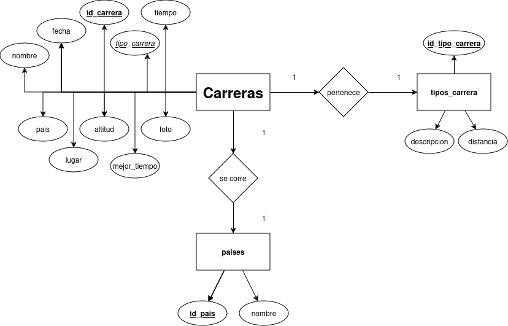
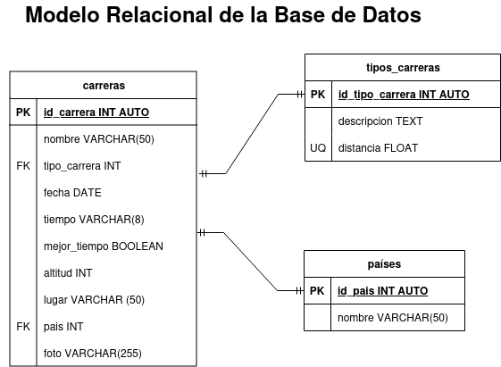

# Carreras

## Listado de Entidades

### carreras **(ED)**

- id_carrera **(PK)** INT AUTO **UNIQUE**
- nombre VARCHAR(50)
- tipo_carrera **(FK)** INT
- fecha DATE
- tiempo VARCHAR(10)
- mejor_tiempo BOOLEAN
- altitud INT
- lugar VARCHAR(50)
- pais **(FK)** INT
- foto VARCHAR(255)

### tipos_carreras **(EC)**

- id_tipo_carrera **(PK)** INT AUTO **UNIQUE**
- descripcion TEXT
- distancia **(UQ)** FLOAT 

### países **(EC)**

- id_pais **(PK)** INT AUTO **UNIQUE**
- nombre VARCHAR(50)

## Relaciones entre entidades

1. Una **carrera** _pertenece_ a un **tipo de carrera**. (_1 a 1_)
1. Una **carrera** se _corre_ a un **país**. (_1 a 1_)

## Diagramas

### Modelo Entidad - Relación

### Modelo Entidad - Relación

